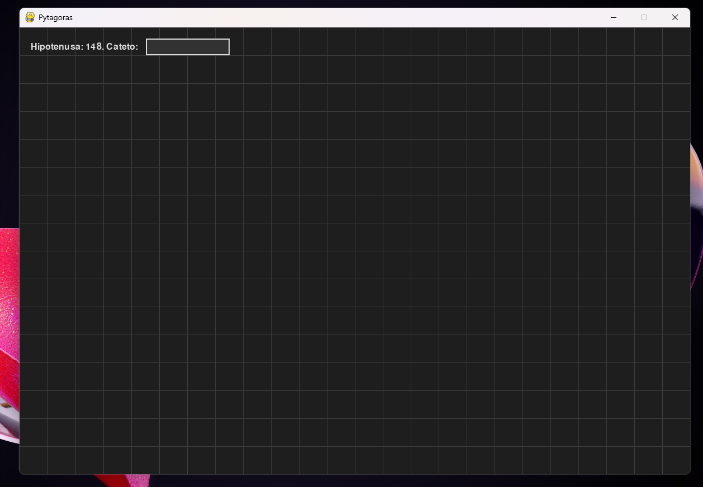
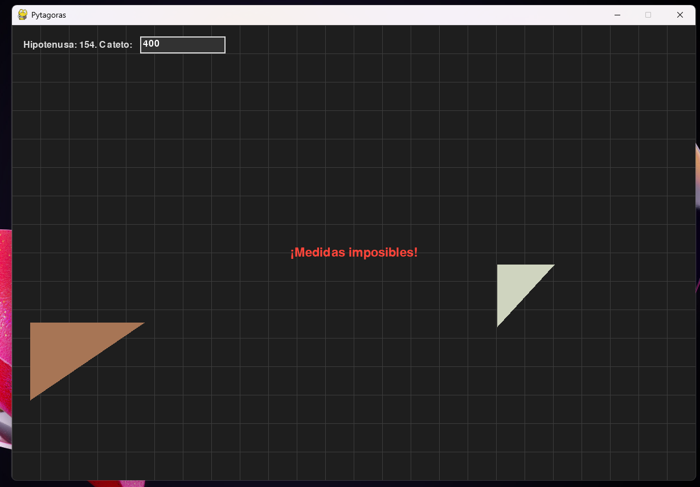
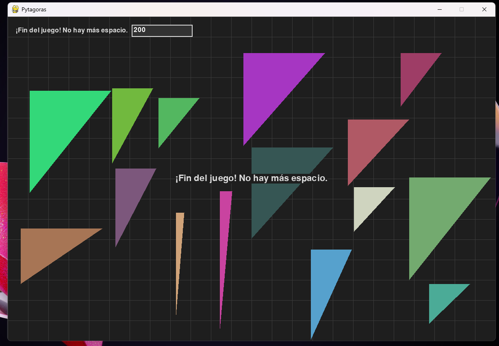
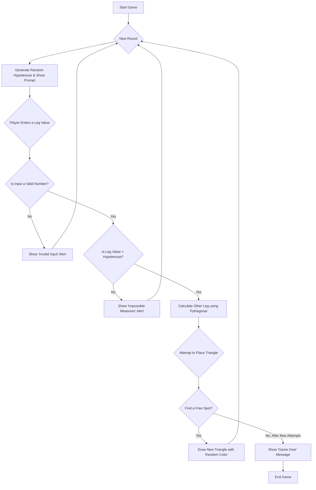

# Pytágoras  📐

[](https://www.hybridge.education)

 

A minimalist and elegant geometry puzzle game built with Python and Pygame. Test your spatial awareness by filling the screen with right-angled triangles\!

## ✨ Features

  * **Dynamic Gameplay:** Each round presents a new randomly generated hypotenuse.
  * **Interactive Input:** You provide the length of one leg to form a unique right triangle.
  * **Collision Detection:** New triangles are placed randomly on the screen but will never overlap existing ones.
  * **Random Colors:** Every new triangle is drawn with a beautiful, random color.
  * **Visual Alerts:** Get instant, clear feedback with on-screen alerts for invalid or impossible inputs.
  * **Sleek Dark Mode:** An eye-pleasing dark mode interface with a grid, inspired by geometry software.

-----

## 🖼️ How it Looks

Here's a snapshot of the game in action. The clean UI shows the current prompt, your input, and the randomly placed triangles on the grid.







-----

## ⚙️ Game Logic Flowchart

This diagram explains the complete operational flow of the program, from starting the game to the game-over condition.



-----

## 📂 Project Structure

The project is organized into a `src` directory to keep the code clean and manageable.

```
geometric-game/
├── main.py
├── README.md
├── requirements.txt
└── src/
    ├── __init__.py
    ├── config.py
    ├── game.py
    └── triangle.py
└── static/
    └── (Pictures of Game)
```

-----

## 🚀 Setup and Installation

To get the game running on your local machine, follow these simple steps.

1.  **Clone the repository:**

    ```bash
    git clone https://github.com/your-username/geometric-game.git
    cd geometric-game
    ```

2.  **Create a virtual environment (Recommended):**

    ```bash
    python -m venv venv
    source venv/bin/activate  # On Windows, use `venv\Scripts\activate`
    ```

3.  **Install the dependencies:**

    ```bash
    pip install -r requirements.txt
    ```

4.  **Run the game\!**

    ```bash
    python main.py
    ```

-----

## 🎮 How to Play

1.  The game will show you the length of a **hypotenuse**.
2.  Your task is to type in a number for the length of one of the **legs** (cathetus). The number must be greater than 0 but less than the hypotenuse.
3.  Press **Enter**.
4.  If your input is valid, a right-angled triangle will be created and drawn in a random, non-overlapping position.
5.  A new round begins immediately with a new hypotenuse.
6.  The game ends when the program can no longer find a free spot to draw the new triangle you've created.

Good luck\! 🍀

-----

## 🛠️ Technologies Used

Copyright © 2025 Jesús Vásquez - Hybridge Education

Este proyecto es material académico desarrollado como parte del programa educativo de Hybridge Education.
